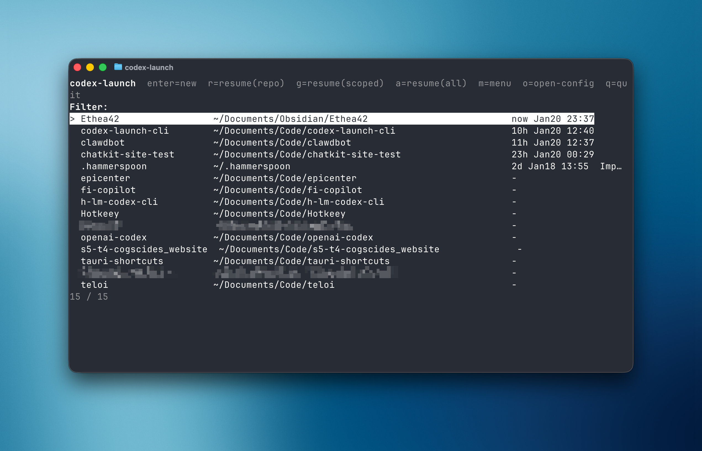
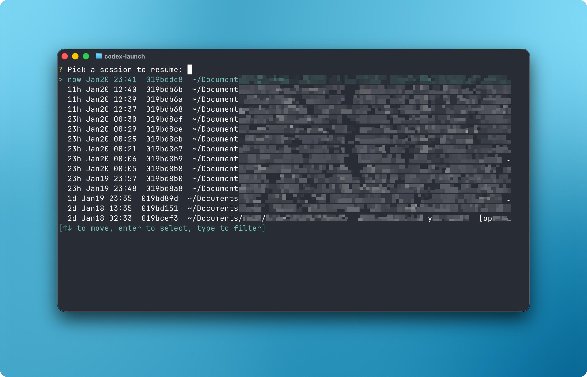

# codex-launch

Small interactive launcher for the Codex CLI. It helps you either:

- start a new Codex session in a chosen folder, or
- resume a recent session from `~/.codex/sessions`.

## Screenshots

Project picker:



Session picker:



## Prerequisites

- `codex` installed and on `PATH`
- Rust toolchain (`cargo`) installed (via `rustup`)

## Install

1. Clone this repo:

```bash
git clone https://github.com/cogscides/codex-launch-cli.git
// or
gh repo clone https://github.com/cogscides/codex-launch-cli.git
```

2. Install the binary:

```
cd codex-launch-cli
cargo install --path .
```

3. Verify:

```bash
codex-launch --version
```

Notes:

- `cargo install` places binaries in `~/.cargo/bin` (make sure it’s on your `PATH`).
- Upgrade from a fresh checkout with `cargo install --path . --force`.
- Uninstall with `cargo uninstall codex-launch`.

## Quick start

First run creates `~/.codex-launch/config.toml`.

Add a parent folder that contains multiple git repos (one-level scan):

```bash
codex-launch add-root ~/Documents/Code
```

Add an explicit folder target (git or non-git):

```bash
codex-launch add-path ~/.hammerspoon
```

Launch picker:

```bash
codex-launch
```

Project picker keybinds (no-args TUI):

- `enter`: new Codex session in selected project
- `r`: resume a session in selected repo
- `g`: browse/resume sessions (scoped)
- `a`: browse/resume sessions (all)
- `m`: open action menu for selected project
- `o`: open config
- `q` / `esc`: quit

Quick launch by fuzzy project match:

```bash
codex-launch chatkit
```

Quick resume by fuzzy session match:

```bash
codex-launch --resume ethea
```

Resume exact session id:

```bash
codex-launch resume-id 019bd6d8-b99b-7eb1-847c-87c3da10673a
```

Resume a recent session (scoped to configured targets):

```bash
codex-launch --recent
```

Resume a recent session (all sessions):

```bash
codex-launch --recent --all-sessions
```

Non-interactive (no TTY): print recent sessions as TSV (`id<TAB>created_at<TAB>cwd<TAB>summary`):

```bash
codex-launch --recent --no-ui --limit 20
```

## Config

Config is stored at `~/.codex-launch/config.toml` (created on first run).

Example:

```toml
[codex]
bin = "codex"
args = []

[projects]
roots = ["~/Documents/Code"]
paths = ["~/.hammerspoon"]
from_sessions = true
sessions_limit = 200

[sessions]
codex_home = "~/.codex"
limit = 15
```

Keys you’ll likely care about:

- `codex.bin`: the `codex` executable to run (default: `"codex"`)
- `codex.args`: default args passed to `codex`
- `projects.roots`: parent folders to scan one-level deep for repos
- `projects.paths`: explicit folder targets
- `sessions.codex_home`: where Codex keeps `sessions/` (default: `~/.codex`)
- `sessions.limit`: how many sessions to show (default: `15`)

## Notes

- `codex-launch` runs `codex` with `current_dir` set to the selected folder (or the session’s recorded `cwd` when resuming).
- Repo discovery only scans direct children of each configured `projects.roots`.
- Targets are also inferred from recent session `cwd`s by default by resolving the git repo root (`projects.from_sessions = true`).

## Troubleshooting

- If the full-screen project picker renders badly in your terminal, try `codex-launch <substring>` (it uses a simpler inline picker) and report your terminal + `$TERM`.
